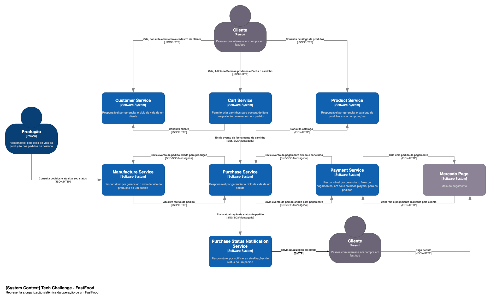

# Customer Microservice

## Problema
Há uma lanchonete de bairro que está expandindo devido seu grande sucesso. Porém, com a expansão e sem um sistema de controle de pedidos, o atendimento aos clientes pode ser caótico e confuso. Por exemplo, imagine que um cliente faça um pedido complexo, como um hambúrguer personalizado com ingredientes específicos, acompanhado de batatas fritas e uma bebida. O atendente pode anotar o pedido em um papel e entregá-lo à cozinha, mas não há garantia de que o pedido será preparado corretamente. Sem um sistema de controle de pedidos, pode haver confusão entre os atendentes e a cozinha, resultando em atrasos na preparação e entrega dos pedidos. Os pedidos podem ser perdidos, mal interpretados ou esquecidos, levando à insatisfação dos clientes e a perda de negócios. Em resumo, um sistema de controle de pedidos é essencial para garantir que a lanchonete possa atender os clientes de maneira eficiente, gerenciando seus pedidos e estoques de forma adequada. Sem ele, expandir a lanchonete pode acabar não dando certo, resultando em clientes insatisfeitos e impactando os negócios de forma negativa. Para solucionar o problema, a lanchonete irá investir em um sistema de autoatendimento de fast food, que é composto por uma série de dispositivos e interfaces que permitem aos clientes selecionar e fazer pedidos sem precisar interagir com um atendente.

## Solução

Foi elaborado um conjunto de serviços para viabilizar a operação da lanchonete.



Nesse repositório, temos a implementação do serviço de pedidos (Customer Microservice).


## Repositórios de IaC

### Repositórios Infra AWS Cloud

Nossa infraestrutura de Cloud está dividida da seguinte forma:

1) [infra-foundation](https://github.com/fiap-postech/infra-foundation): Repositório com a infra-estrutura responsável por toda infra de fundação na qual inclui camada de rede (VPC), Security Groups, Subnets, Internet Gateway, API Gateway e etc.
2) [infra-microservice-foundation](https://github.com/fiap-postech/infra-microservice-foundation): Repositório com a infra-estrutura base para micro serviços: AWS ECS Cluster, API Gateway, CDN.

### Repositórios Lambdas Autenticação JWT

Os nossos repositórios para autenticação utilizando o conceito serverless são:

1) [json-web-token-signer](https://github.com/fiap-postech/json-web-token-signer): Repositório que contem a lógica da lambda de geração do token de da autenticação.
2) [json-web-token-verifier](https://github.com/fiap-postech/json-web-token-verifier): Repositório com a lambda que possui a chave privada para validar se o token passado no header de Authorization é um token válido.

### Repositório Infra Customer Microservice

1) [iac-customer-microservice](https://github.com/fiap-postech/iac-customer-microservice): Repositório que contem o código de aprovisionamento dos recursos para o workload do customer microservice.

## Estrutura Geral do Projeto
```
./customer-microservice
├── Dockerfile
├── README.md
├── adapter
│ ├── build.gradle
│ └── src
│     └── main
│         └── java
│             └── br
│                 └── com
│                     └── fiap
│                         └── tech
│                             └── challenge
│                                 └── adapter
│                                     ├── controller
│                                     │ └── customer
│                                     ├── dto
│                                     ├── gateway
│                                     │ └── customer
│                                     ├── mapping
│                                     ├── presenter
│                                     └── repository
├── application
│ ├── build.gradle
│ └── src
│     └── main
│         └── java
│             └── br
│                 └── com
│                     └── fiap
│                         └── tech
│                             └── challenge
│                                 └── application
│                                     ├── dto
│                                     ├── gateway
│                                     └── usecase
│                                         └── customer
├── build.gradle
├── documentation
├── drivers
│ ├── mysql
│ │ ├── build.gradle
│ │ └── src
│ │     └── main
│ │         └── java
│ │             └── br
│ │                 └── com
│ │                     └── fiap
│ │                         └── tech
│ │                             └── challenge
│ │                                 └── driven
│ │                                     └── mysql
│ │                                         ├── config
│ │                                         ├── mapping
│ │                                         ├── model
│ │                                         ├── repository
│ │                                         └── service
│ └── rest
│     ├── build.gradle
│     └── src
│         └── main
│             └── java
│                 └── br
│                     └── com
│                         └── fiap
│                             └── tech
│                                 └── challenge
│                                     └── rest
│                                         ├── config
│                                         ├── mapping
│                                         └── resource
│                                             ├── doc
│                                             ├── request
│                                             └── response
├── enterprise
│ ├── build.gradle
│ └── src
│     └── main
│         └── java
│             └── br
│                 └── com
│                     └── fiap
│                         └── tech
│                             └── challenge
│                                 └── enterprise
│                                     ├── entity
│                                     ├── error
│                                     └── valueobject
├── infra
│ └── docker
│     └── mysql
│         └── script
├── launcher
│ ├── build.gradle
│ └── src
│     └── main
│         └── java
│             └── br
│                 └── com
│                     └── fiap
│                         └── tech
│                             └── challenge
│                                 └── launcher
│                                     └── configuration
└── settings.gradle
```

## Como executar o projeto?

### Pré-Requisitos ⚙️

<br>
<br>


### Preparação 💻

Independente da forma que escolha para executar o projeto, temos o seguinte procedimento a ser executado:

1. Clone o projeto desse repositório do Github
```sh
git clone https://github.com/fiap-postech/customer-microservice.git
```
2. Acesse a pasta do projeto pelo terminal/cmd
```sh
cd customer-microservice
```
3. Execute o comando de build do projeto
```sh
./gradlew build
```

### Execução 🏃

1. Execute o docker-compose.yml para iniciar o provisionamento da infra local
```sh
docker-compose -f infra/docker-compose-local.yml up -d
```
2. Com isso, você já pode executar o projeto pela IDE de sua preferência ou, se preferir, pode executar o projeto pela
   linha de comando com:
```sh
./gradlew bootRun
```
Ao executar o serviço, o servidor responderá no endereço: `http://localhost:8689`. Ao acessar essa url você será redirecionado ao swagger do projeto.
